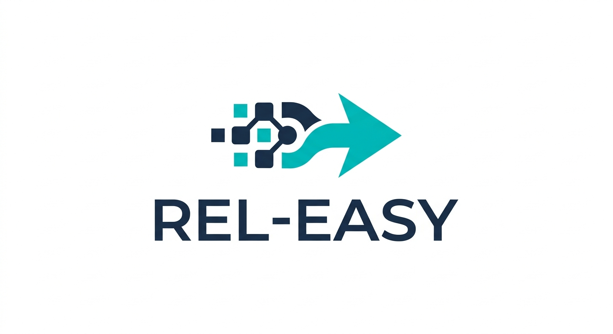

<p align="center">
  
</p>

# REL-EASY — Making API Releases Easy

Automate Azure DevOps build triggering, approval gating, and deferral across DEV (QC), UAT, and PROD — turning a multi-hour manual release process into a handful of Python commands.

---

## What Gets Automated

| Without REL-EASY | With REL-EASY |
|---|---|
| Manually queue builds per pipeline | One command triggers all pipelines |
| Click approve on every QC gate | Auto-approved in parallel |
| Hunt for which build is ready for UAT/PROD | Tracker scripts surface the right build instantly |
| Schedule UAT/PROD releases manually | Enter a time once — all gates deferred automatically |
| Share screenshots of build status | Professional Excel reports with clickable links |

---

## Architecture

REL-EASY is a 6-script toolkit organised across three release phases:

```
┌─────────────────────────────────────────────────────────────────┐
│  PHASE 1 — DEV / QC                                             │
│                                                                  │
│  dev_build_creator.py   →  Trigger DEVELOPMENT builds on all   │
│                             pipelines in parallel               │
│                                                                  │
│  dev_build_approver.py  →  Poll each build and auto-approve     │
│                             the "DEV: QC Approval" gate         │
└──────────────────────────────────┬──────────────────────────────┘
                                   │ reports/qc/*.json
┌──────────────────────────────────▼──────────────────────────────┐
│  PHASE 2 — UAT                                                   │
│                                                                  │
│  uat_build_tracker.py   →  Find the latest QC-passed build      │
│                             not yet promoted to UAT             │
│                                                                  │
│  uat_build_approver.py  →  Defer the "UAT Approval" gate to a   │
│                             scheduled date/time                  │
└──────────────────────────────────┬──────────────────────────────┘
                                   │ reports/uat/*.json
┌──────────────────────────────────▼──────────────────────────────┐
│  PHASE 3 — PROD                                                  │
│                                                                  │
│  prod_build_tracker.py  →  Find the latest UAT-passed build     │
│                             not yet promoted to PROD            │
│                                                                  │
│  prod_build_approver.py →  Approve Gate 1 immediately;          │
│                             defer Gate 2 to a scheduled time    │
└─────────────────────────────────────────────────────────────────┘
```

Each script outputs a report pair to `reports/<env>/`:
- `*_YYYYMMDD_HHMM.xlsx` — formatted Excel dashboard with clickable build links
- `*_YYYYMMDD_HHMM.json` — raw data consumed by the next phase's approver script

---

## Prerequisites

- Python 3.8+
- Install dependencies once:
  ```bash
  pip install requests openpyxl
  ```
- An Azure DevOps Personal Access Token (PAT) — see [Getting Your PAT](#getting-your-pat-token) below

---

## Getting Your PAT Token

1. Go to [https://scmdevops.visualstudio.com](https://scmdevops.visualstudio.com)
2. Click your **profile picture** (top right) → **Personal Access Tokens**
3. Click **+ New Token**
4. Give it a name (e.g. `rel-easy`) and set an expiry date
5. Under **Scopes**, select the permissions for the scripts you intend to use:

   | Script | Required Scopes |
   |---|---|
   | `dev_build_creator.py` | Build: Read & Execute |
   | `dev_build_approver.py` | Build: Read · Pipeline Resources: Use & Manage |
   | `uat_build_tracker.py` | Build: Read |
   | `uat_build_approver.py` | Build: Read · Pipeline Resources: Use & Manage |
   | `prod_build_tracker.py` | Build: Read |
   | `prod_build_approver.py` | Build: Read · Pipeline Resources: Use & Manage |

6. Click **Create** and **copy the token immediately** — it will not be shown again
7. Paste the token into the `"pat"` field in the `CONFIG` section of each script you use

---

## Configuration

Every script has a `CONFIG` dictionary near the top. Fill in these fields before running:

```python
CONFIG = {
    "org":     "scmdevops",   # Azure DevOps organisation name
    "project": "Leo.TPRM",    # Project name
    "pat":     "<YOUR_PAT_HERE>",  # PAT token from the step above
    ...
}
```

Additional per-script options are documented inside each file's `CONFIG` block with inline comments.

---

## Phase 1 — DEV / QC

### Step 1: Trigger DEV Builds

```bash
python release-prep/dev_build_creator.py
```

Triggers builds on the `DEVELOPMENT` branch across all eligible pipelines in parallel.

**Output:** `reports/qc/dev_build_report_YYYYMMDD_HHMM.{xlsx,json}`

| Status | Meaning |
|---|---|
| Triggered | Build successfully queued |
| Failed to Trigger | Could not queue (check PAT scopes or branch name) |

---

### Step 2: Auto-Approve QC Gates

```bash
python release-approvals/dev_build_approver.py
```

Reads the latest `dev_build_report_*.json`, polls each build in parallel, and auto-approves the `DEV: QC Approval` gate when it appears.

**Output:** `reports/qc/dev_approval_report_YYYYMMDD_HHMM.{xlsx,json}`

| Status | Meaning |
|---|---|
| Approved | Gate found and approved |
| Pending | Waiting for gate to appear |
| Build Failed | Build failed before reaching the gate |
| Timed Out | Gate not reached within the configured timeout |
| No Gate Found | Build completed but no approval gate was seen |

---

## Phase 2 — UAT

### Step 3: Find Builds Ready for UAT

```bash
python release-prep/uat_build_tracker.py
```

Scans all pipelines and surfaces the most recent build from `DEVELOPMENT`/`HOTFIX` branches that passed QC but has not yet reached UAT.

**Output:** `reports/uat/uat_release_report_YYYYMMDD_HHMM.{xlsx,json}`

| Status | Meaning |
|---|---|
| Found | QC-passed build ready for UAT |
| Superseded by UAT | A newer build is already at UAT |
| Wrong Variables | Build found but failed pipeline variable checks |
| No QC Build Found | No completed QC stage in recent builds |

---

### Step 4: Schedule UAT Approval

```bash
python release-approvals/uat_build_approver.py
```

Reads the latest `uat_release_report_*.json` and defers the `UAT Approval` gate for every found build to your specified date and time.

You will be prompted for:
- **Date/time** — e.g. `tomorrow 09:00` or `2026-03-15 22:00`
- **Timezone** — IANA name, e.g. `Asia/Kolkata` (defaults to `Asia/Kolkata`)

**Output:** `reports/uat/uat_approval_report_YYYYMMDD_HHMM.{xlsx,json}`

> **Need to change the time?** Simply re-run the script and enter the new time. Already-deferred gates are updated automatically — no manual cleanup needed.

---

## Phase 3 — PROD

### Step 5: Find Builds Ready for PROD

```bash
python release-prep/prod_build_tracker.py
```

Scans all pipelines and surfaces the most recent build that passed UAT but has not yet reached PROD. PROD deployments from `hotfix` branches are intentionally ignored — a hotfix is a bug fix, not a release candidate.

**Output:** `reports/prod/prod_release_report_YYYYMMDD_HHMM.{xlsx,json}`

| Status | Meaning |
|---|---|
| Found | UAT-passed build ready for PROD |
| Superseded by PROD | A newer non-hotfix build is already in PROD |
| Wrong Variables | Build found but failed pipeline variable checks |
| No UAT Build Found | No completed UAT stage in recent builds |

---

### Step 6: Schedule PROD Approval

```bash
python release-approvals/prod_build_approver.py
```

Reads the latest `prod_release_report_*.json` and handles two sequential gates per build:
1. **Prod Gate Validation** — approved immediately
2. **PROD Approval** — deferred to your specified date and time

You will be prompted for the same date/time and timezone as the UAT approver.

**Output:** `reports/prod/prod_approval_report_YYYYMMDD_HHMM.{xlsx,json}`

> **Need to change the time?** Re-run the script and enter the new time. Already-deferred PROD gates are updated automatically.

---

## Reports

Every script generates a formatted Excel workbook containing:
- **KPI dashboard** — totals for each status at a glance
- **Per-pipeline rows** — colour-coded status, build number, branch, commit, triggered by, timestamp
- **Clickable build links** — jump directly to the Azure DevOps build page
- **"How To Use" sheet** — embedded instructions so the report is self-contained

Reports are written to `reports/<env>/` and are never overwritten (each run creates a new timestamped file).

---

## Key Design Notes

- **Parallel processing** — all scan and approval operations run concurrently via `ThreadPoolExecutor`, keeping runtimes low even across 50+ pipelines
- **Re-entrant approvals** — approval scripts can be re-run with a new time at any point to update already-deferred gates
- **Hotfix awareness** — `prod_build_tracker.py` skips PROD-deployed hotfix builds when looking for release candidates, so a bug fix never blocks the next sprint release from showing up
- **Connection pooling** — a shared `requests.Session` with pooling prevents Windows ephemeral port exhaustion (`WinError 10048`) during large parallel scans
- **Auto-retry** — all HTTP calls retry automatically on `429`/`5xx` responses with exponential backoff
